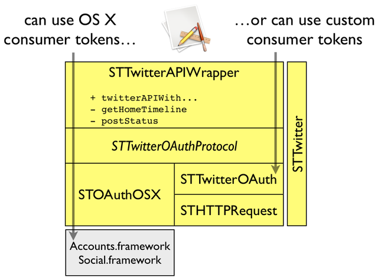

## STTwitter

_A lightweight Objective-C wrapper for Twitter REST API 1.1_

### Project News

[2013-04] [nightly build](http://seriot.ch/resources/abusing_twitter_api/STTwitter.app.zip) 114 KB (signed)  
[2013-03] [Adium](http://adium.im/) developers have [chosen](http://permalink.gmane.org/gmane.network.instant-messaging.adium.devel/2332) to use STTwitter to handle Twitter connectivity in Adium, starting from version 1.5.7.

### Typical Usage

##### 1a. Copy the `STTwitter` directory into your project OR
##### 1b. If you're using CocoaPods, simply include the `STTwitter` pod in your project's podfile:
	pod 'STTwitter'
#####and then
	pod install

##### 2. Import STTwitterAPIWrapper

    #import "STTwitterAPIWrapper.h"

##### 3. Instantiate `STTwitterAPIWrapper`

    STTwitterAPIWrapper *twitter = [STTwitterAPIWrapper twitterAPIWithOAuthOSX];

##### 4. Verify the credentials

    [twitter verifyCredentialsWithSuccessBlock:^(NSString *username) {
        // ...
    } errorBlock:^(NSError *error) {
        // ...
    }];

##### 5. Get the timeline statuses

    [twitter getHomeTimelineSinceID:nil count:@"20" successBlock:^(NSArray *statuses) {
        // ...
    } errorBlock:^(NSError *error) {
        // ...
    }];
   
	    
    
### Demo Project

STTwitter demo project lets you choose how to get the OAuth tokens (see below).

Once you got the OAuth tokens, you can get your timeline and post a new status.

### OAuth Connection

You can instantiate `STTwitterAPIWrapper` in three ways:

- use the Twitter account set in OS X Preferences
- use a custom `consumer key` and `consumer secret` (three flavors)
  - get an URL, fetch a PIN, enter it in your app, get oauth access tokens  
  - set `username` and `password`, get oauth access tokens with XAuth, if the app is entitled to
  - set `oauth token` and `oauth token secret` directly
- use the new [Application Only](https://dev.twitter.com/docs/auth/application-only-auth) authentication and get / use a "bearer token"

So there are five cases altogether, hence the four methods:

    + (STTwitterAPIWrapper *)twitterAPIWithOAuthOSX;

    + (STTwitterAPIWrapper *)twitterAPIWithOAuthConsumerKey:(NSString *)consumerKey
                                             consumerSecret:(NSString *)consumerSecret;

    + (STTwitterAPIWrapper *)twitterAPIWithOAuthConsumerKey:(NSString *)consumerKey
                                             consumerSecret:(NSString *)consumerSecret
                                                   username:(NSString *)username
                                                   password:(NSString *)password;

    + (STTwitterAPIWrapper *)twitterAPIWithOAuthConsumerKey:(NSString *)consumerKey
                                             consumerSecret:(NSString *)consumerSecret
                                                 oauthToken:(NSString *)oauthToken
                                           oauthTokenSecret:(NSString *)oauthTokenSecret;
                   
    + (STTwitterAPIWrapper *)twitterAPIApplicationOnlyWithConsumerKey:(NSString *)consumerKey
                                                       consumerSecret:(NSString *)consumerSecret;
                   
                                           
### OAuth Consumer Key / Consumer Secret

In Twitter REST API v1.1, each client application must authenticate itself with `consumer key` and `consumer secret` tokens. With STTwitter you can provide the tokens you want. You can request consumer tokens for your app on Twitter website: [https://dev.twitter.com/apps](https://dev.twitter.com/apps).

STTwitter demo project comes with `TwitterClients.plist` where you can enter your own consumer tokens.

### Architecture

Your code only interacts with `STTwitterAPIWrapper`.

`STTwitterAPIWrapper` maps Objective-C methods with the Twitter API resources and parameters.

`STTwitterAPIWrapper` implements the most common Twitter API methods, add more if you need to.

`STTwitterAPIWrapper` uses `STAuthOSX` or `STTwitterOAuth` to actually connect to Twitter.

`STTwitterOSX` uses OS X 10.8 `Accounts.framework` and `Social.framework`.

`STTwitterOAuth` implements the OAuth procotol, specifically for Twitter.

`STTwitterAppOnly` implements the [Application Only](https://dev.twitter.com/docs/auth/application-only-auth) OAuth 2.0 authentication for Twitter.

`STTwitterOAuth` and `STTwitterAppOnly` both relies on `STHTTPRequest` to POST and GET asynchronous HTTP requests.

### BSD 3-Clause License

Copyright (c) 2012-2013, Nicolas Seriot
All rights reserved.
    
Redistribution and use in source and binary forms, with or without modification, are permitted provided that the following conditions are met:
    
* Redistributions of source code must retain the above copyright notice, this list of conditions and the following disclaimer.
* Redistributions in binary form must reproduce the above copyright notice, this list of conditions and the following disclaimer in the documentation and/or other materials provided with the distribution.
* Neither the name of the Nicolas Seriot nor the names of its contributors may be used to endorse or promote products derived from this software without specific prior written permission.
    
THIS SOFTWARE IS PROVIDED BY THE COPYRIGHT HOLDERS AND CONTRIBUTORS "AS IS" AND ANY EXPRESS OR IMPLIED WARRANTIES, INCLUDING, BUT NOT LIMITED TO, THE IMPLIED WARRANTIES OF MERCHANTABILITY AND FITNESS FOR A PARTICULAR PURPOSE ARE DISCLAIMED. IN NO EVENT SHALL THE COPYRIGHT HOLDER OR CONTRIBUTORS BE LIABLE FOR ANY DIRECT, INDIRECT, INCIDENTAL, SPECIAL, EXEMPLARY, OR CONSEQUENTIAL DAMAGES (INCLUDING, BUT NOT LIMITED TO, PROCUREMENT OF SUBSTITUTE GOODS OR SERVICES; LOSS OF USE, DATA, OR PROFITS; OR BUSINESS INTERRUPTION) HOWEVER CAUSED AND ON ANY THEORY OF LIABILITY, WHETHER IN CONTRACT, STRICT LIABILITY, OR TORT (INCLUDING NEGLIGENCE OR OTHERWISE) ARISING IN ANY WAY OUT OF THE USE OF THIS SOFTWARE, EVEN IF ADVISED OF THE POSSIBILITY OF SUCH DAMAGE.
