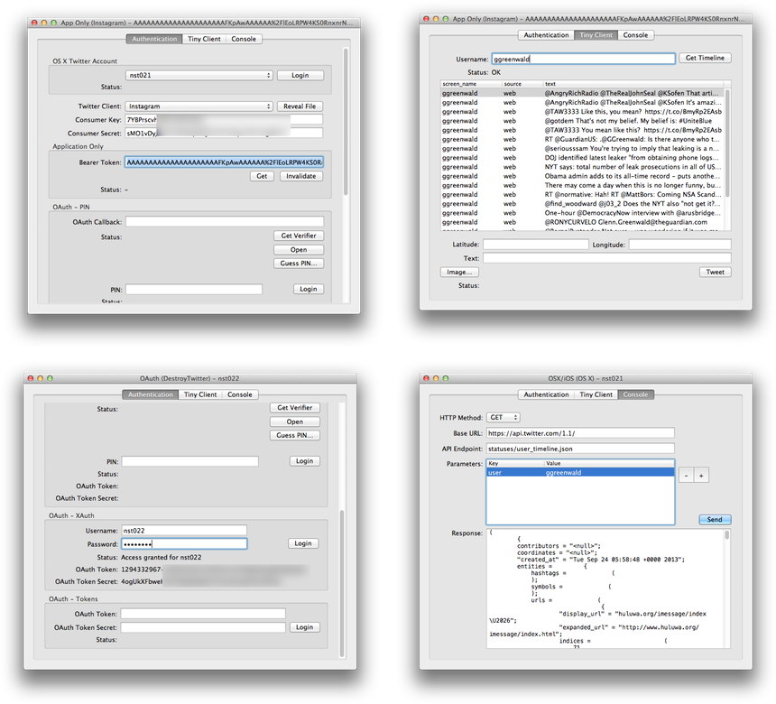
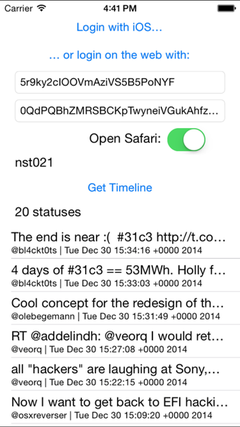

## STTwitter

_A comprehensive Objective-C library for Twitter REST API 1.1_

> STTwitter will be presented at [SoftShake](http://soft-shake.ch) 2013, Geneva, on October 24th.

1. [Installation](#installation)
2. [Code Snippets](#code-snippets)
3. [Various Kinds of OAuth Connections](#various-kinds-of-oauth-connections)
4. [OAuth Consumer Tokens](#oauth-consumer-tokens)
5. [Demo / Test Project](#demo--test-project)
6. [Integration Tips](#integration-tips)
7. [Troubleshooting](#troubleshooting)
8. [Developers](#developers)
9. [Applications Using STTwitter](#applications-using-sttwitter)
10. [BSD 3-Clause License](#bsd-3-clause-license)

### Installation

Drag and drop STTwitter directory into your project.

Link your project with the following frameworks:

- Accounts.framework
- Twitter.framework
- Security.framework (OS X only)
- Social.framework (iOS only, weak)

If you want to use CocoaPods, add the two following lines to your Podfile:

    pod 'STTwitter'
    platform :ios, '5.0'

Then, run the following command to install the STTwitter pod:

    pod install

STTwitter does not depend on AppKit or UIKit and can be used in a command-line Twitter client.

STTwitter requires iOS 5+ or OS X 10.7+.

### Code Snippets

Notes:

- STTwitter must be used from the main thread
- all callbacks are called on the main thread

##### Instantiate STTwitterAPI

    STTwitterAPI *twitter = [STTwitterAPI twitterAPIWithOAuthConsumerKey:@""
                                                          consumerSecret:@""
                                                                username:@""
                                                                password:@""];

##### Verify the credentials

    [twitter verifyCredentialsWithSuccessBlock:^(NSString *username) {
        // ...
    } errorBlock:^(NSError *error) {
        // ...
    }];

##### Get the timeline statuses

    [twitter getHomeTimelineSinceID:nil
                              count:100
                       successBlock:^(NSArray *statuses) {
        // ...
    } errorBlock:^(NSError *error) {
        // ...
    }];

##### Streaming API

    [twitter getStatusesSampleDelimited:nil
                          stallWarnings:nil
                          progressBlock:^(id response) {
        // ...
    } stallWarningBlock:nil
             errorBlock:^(NSError *error) {
        // ...
    }];

##### App Only Authentication

    STTwitterAPI *twitter = [STTwitterAPI twitterAPIAppOnlyWithConsumerKey:@""
                                                            consumerSecret:@""];
    
    [twitter verifyCredentialsWithSuccessBlock:^(NSString *bearerToken) {
        
        [twitter getUserTimelineWithScreenName:@"barackobama"
                                  successBlock:^(NSArray *statuses) {
            // ...
        } errorBlock:^(NSError *error) {
            // ...
        }];
    
    } errorBlock:^(NSError *error) {
        // ...
    }];

### Various Kinds of OAuth Connections

You can instantiate `STTwitterAPI` in three ways:

- use the Twitter account set in OS X Preferences or iOS Settings
- use a custom `consumer key` and `consumer secret` (three flavors)
  - get an URL, fetch a PIN, enter it in your app, get oauth access tokens  
  - set `username` and `password`, get oauth access tokens with XAuth, if the app is entitled to
  - set `oauth token` and `oauth token secret` directly
- use the [Application Only](https://dev.twitter.com/docs/auth/application-only-auth) authentication and get / use a "bearer token"

So there are five cases altogether, hence these five methods:

    + (STTwitterAPI *)twitterAPIOSWithFirstAccount;

    + (STTwitterAPI *)twitterAPIWithOAuthConsumerKey:(NSString *)consumerKey
                                      consumerSecret:(NSString *)consumerSecret;

    + (STTwitterAPI *)twitterAPIWithOAuthConsumerKey:(NSString *)consumerKey
                                      consumerSecret:(NSString *)consumerSecret
                                            username:(NSString *)username
                                            password:(NSString *)password;

    + (STTwitterAPI *)twitterAPIWithOAuthConsumerKey:(NSString *)consumerKey
                                      consumerSecret:(NSString *)consumerSecret
                                          oauthToken:(NSString *)oauthToken
                                    oauthTokenSecret:(NSString *)oauthTokenSecret;
                   
    + (STTwitterAPI *)twitterAPIAppOnlyWithConsumerKey:(NSString *)consumerKey
                                        consumerSecret:(NSString *)consumerSecret;

##### Reverse Authentication

Reference: [https://dev.twitter.com/docs/ios/using-reverse-auth](https://dev.twitter.com/docs/ios/using-reverse-auth)

The most common use case of reverse authentication is letting users register/login to a remote service with their OS X or iOS Twitter account.

    iOS/OSX     Twitter     Server
    -------------->                 reverse auth.
    < - - - - - - -                 access tokens
        
    ----------------------------->  access tokens
        
                   <--------------  access Twitter on user's behalf
                    - - - - - - ->

Here is how to use reverse authentication with STTwitter:

    STTwitterAPI *twitter = [STTwitterAPI twitterAPIWithOAuthConsumerName:nil
                                                              consumerKey:@"CONSUMER_KEY"
                                                           consumerSecret:@"CONSUMER_SECRET"];
    
    [twitter postReverseOAuthTokenRequest:^(NSString *authenticationHeader) {
        
        STTwitterAPI *twitterAPIOS = [STTwitterAPI twitterAPIOSWithFirstAccount];
        
        [twitterAPIOS verifyCredentialsWithSuccessBlock:^(NSString *username) {
            
            [twitterAPIOS postReverseAuthAccessTokenWithAuthenticationHeader:authenticationHeader
                                                                successBlock:^(NSString *oAuthToken,
                                                                               NSString *oAuthTokenSecret,
                                                                               NSString *userID,
                                                                               NSString *screenName) {
                                                                    
                                                                    // use the tokens...
                                                                    
                                                                } errorBlock:^(NSError *error) {
                                                                    // ...
                                                                }];
            
        } errorBlock:^(NSError *error) {
            // ...
        }];
        
    } errorBlock:^(NSError *error) {
        // ...
    }];

Contrary to what can be read here and there, you can perfectly [access direct messages from iOS Twitter accounts](http://stackoverflow.com/questions/17990484/accessing-twitter-direct-messages-using-slrequest-ios/18760445#18760445).

### OAuth Consumer Tokens

In Twitter REST API v1.1, each client application must authenticate itself with `consumer key` and `consumer secret` tokens. You can request consumer tokens for your app on Twitter website: [https://dev.twitter.com/apps](https://dev.twitter.com/apps).

STTwitter demo project comes with `TwitterClients.plist` where you can enter your own consumer tokens.

### Demo / Test Project

There is a demo project for OS X in `demo_osx`, which lets you choose how to get the OAuth tokens (see below).

An archive generated on 2013-10-20 10:35 is available at [http://seriot.ch/temp/STTwitterDemoOSX.app.zip](http://seriot.ch/temp/STTwitterDemoOSX.app.zip).

Once you got the OAuth tokens, you can get your timeline and post a new status.

There is also a simple iOS demo project in `demo_ios`.

</img> 
</img> 
</img>

### Integration Tips

##### Remove Asserts in Release Mode

There are several asserts in the code. They are very useful in debug mode but you should not include them in release.

New projects created with XCode 5 already remove NSAssert logic by default in release.

In older projects, you can set the compilation flag `-DNS_BLOCK_ASSERTIONS=1`.

##### Number of Characters in a Tweet

Use the method `-[NSString numberOfCharactersInATweet]` to let the user know how many characters she can enter before the end of the Tweet. The method may also return a negative value if the string exceeds a tweet's maximum length. The method considers the shortened URL lengths.

##### Boolean Parameters

There are a lot of optional parameters In Twitter API. In STTwitter, you can ignore such parameters by passing `nil`. Regarding boolean parameters, STTwitter can't just use Objective-C `YES` and `NO` because `NO` has the same value as `nil` (zero). So boolean parameters are wrapped into `NSNumber` objects, which are pretty easy to use with boolean values thanks to Objective-C literals. So, with STTwitter, you will give an optional parameter of Twitter API either `@(YES)`, `@(NO)` or `nil`.

##### Long Methods

STTwitter provides a full, "one-to-one" Objective-C front-end to Twitter REST API. It often results in long methd names with many parameters. In your application, you may want to add your own simplified methods on top of STTwitterAPI. A good idea is to create an Objective-C category for your application, such as shown in the following code.

`STTwitterAPI+MyApp.h`

    #import "STTwitterAPI.h"

    @interface STTwitterAPI (MyApp)
    
    - (void)getStatusesShowID:(NSString *)statusID
                 successBlock:(void(^)(NSDictionary *status))successBlock
                   errorBlock:(void(^)(NSError *error))errorBlock;
    
    @end

`STTwitterAPI+MyApp.m`
    
    #import "STTwitterAPI+MyApp.h"

    @implementation STTwitterAPI (MyApp)
    
    - (void)getStatusesShowID:(NSString *)statusID
                 successBlock:(void(^)(NSDictionary *status))successBlock
                   errorBlock:(void(^)(NSError *error))errorBlock {
    
        [self getStatusesShowID:statusID
                       trimUser:@(YES)
               includeMyRetweet:nil
                includeEntities:@(NO)
                   successBlock:^(NSDictionary *status) {
    
                       successBlock(status);
    
                   } errorBlock:^(NSError *error) {
            
                       errorBlock(error);
    
                   }];
    }
    
    @end

### Troubleshooting

##### xAuth

Twitter restricts the xAuth authentication process to xAuth-enabled consumer tokens only. So if you get an error like `NSURLErrorDomain Code=-1012, Unhandled authentication challenge type - NSURLAuthenticationMethodOAuth2` while accessing `https://api.twitter.com/oauth/access_token` then your consumer tokens are probably not xAuth-enabled. You can read more on this on Twitter website [https://dev.twitter.com/docs/oauth/xauth](https://dev.twitter.com/docs/oauth/xauth) and ask Twitter to enable the xAuth authentication process for your consumer tokens.

##### Concurrency

STTwitter is supposed to be used from main thread. The network requests are performed anychronously and the callbacks are guaranteed to be called on main thread.

##### Anything Else

Please [fill an issue](https://github.com/nst/STTwitter/issues) on GitHub.

### Developers

The application only interacts with `STTwitterAPI`.

`STTwitterAPI` maps Objective-C methods with all documented Twitter API endpoints.

You can create your own convenience methods with fewer parameters. You can also use this generic methods directly:

    - (NSString *)fetchResource:(NSString *)resource
                     HTTPMethod:(NSString *)HTTPMethod
                  baseURLString:(NSString *)baseURLString
                     parameters:(NSDictionary *)parameters
                  progressBlock:(void (^)(NSString *requestID, id response))progressBlock
                   successBlock:(void (^)(NSString *requestID, NSDictionary *headers, id response))successBlock
                     errorBlock:(void (^)(NSString *requestID, NSDictionary *headers, NSError *error))errorBlock;

##### Layer Model
     
     +-----------------------------------------------------------------+
     |                         Your Application                        |
     +-------------------------------------------------+---------------+
     |                  STTwitterAPI                   | STTwitterHTML |
     +-------------------------------------------------+---------------+
     + - - - - - - - - - - - - - - - - - - - - - - - - +
     |              STTwitterOAuthProtocol             |
     + - - - - - - - - - - - - - - - - - - - - - - - - +
     +-------------+----------------+------------------+
     | STTwitterOS | STTwitterOAuth | STTwitterAppOnly |
     |             +----------------+------------------+---------------+
     |             |                   STHTTPRequest                   |
     +-------------+---------------------------------------------------+
      |
      + Accounts.framework
      + Social.framework
     
##### Summary
     
     * STTwitterAPI
        - can be instantiated with the authentication mode you want
        - provides methods to interact with each Twitter API endpoint

     * STTwitterHTML
        - a hackish class to login on Twitter by parsing the HTML code and get a PIN
        - it can break at anytime, your app should not rely on it in production

     * STTwitterOAuthProtocol
        - provides generic methods to POST and GET resources on Twitter hosts
     
     * STTwitterOS
        - uses Twitter accounts defined in OS X Preferences or iOS Settings
        - uses OS X / iOS frameworks to interact with Twitter API
     
     * STTwitterOAuth
        - implements OAuth and xAuth authentication

     * STTwitterAppOnly
        - implements the 'app only' authentication
        - https://dev.twitter.com/docs/auth/application-only-auth

     * STHTTPRequest
        - block-based wrapper around NSURLConnection
        - https://github.com/nst/STHTTPRequest

### Applications Using STTwitter

* [Adium](http://adium.im/) developers have [chosen](http://permalink.gmane.org/gmane.network.instant-messaging.adium.devel/2332) to use STTwitter to handle Twitter connectivity in Adium, starting from version 1.5.7.

### BSD 3-Clause License

See [LICENSE.txt](LICENSE.txt).
