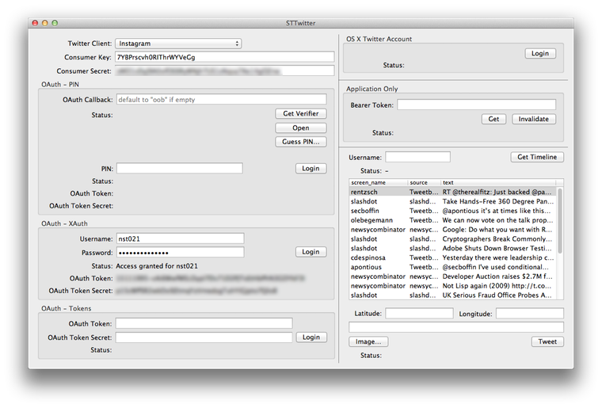
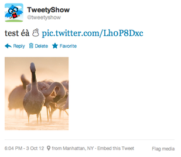

## STTwitter

_A comprehensive Objective-C library for Twitter REST API 1.1_

### Project News

[2013-08] All Twitter API endpoints are implemented, including the streaming ones (see an example below). Also, STTwitter will be presented at [SoftShake](http://soft-shake.ch) 2013, Geneva, on October 24th.  
[2013-06] STTwitter 0.0.2 is [available on CocoaPods](https://github.com/CocoaPods/Specs/tree/master/STTwitter) thanks to Evan Roth (bug fixes, implemented all 'Lists' API endpoints)  
[2013-05] STTwitter 0.0.1 is [available on CocoaPods](https://github.com/CocoaPods/Specs/tree/master/STTwitter) thanks to Evan Roth  
[2013-04] [nightly build](http://seriot.ch/resources/abusing_twitter_api/STTwitter.app.zip) 114 KB (signed)  
[2013-03] STTwitter can use [Application Only](https://dev.twitter.com/docs/auth/application-only-auth) authentication  
[2013-03] [Adium](http://adium.im/) developers have [chosen](http://permalink.gmane.org/gmane.network.instant-messaging.adium.devel/2332) to use STTwitter to handle Twitter connectivity in Adium, starting from version 1.5.7.

### Short Description

`STTwitter` is comprehensive Objective-C library for Twitter REST API 1.1.

It works on iOS 5+ and OS X 10.7+.

### Installation

##### Standard Way

Just copy the `STTwitter` directory into your project and that's it.

##### CocoaPods

Iif you are using CocoaPods, include the `STTwitter` pod in your project's podfile:

    pod 'STTwitter'

and install it:

	pod install

##### ARC

`STTwitter` compiles without modification with non-ARC projects.

If the project uses ARC, add the `-fno-objc-arc` flag to `STTwitter` files ([explanations here](http://stackoverflow.com/questions/6646052/how-can-i-disable-arc-for-a-single-file-in-a-project)).

### Sample Usage

##### 1. Instantiate `STTwitterAPIWrapper`

    STTwitterAPIWrapper *twitter =
        [STTwitterAPIWrapper twitterAPIWithOAuthConsumerName:@""
                                                 consumerKey:@""
                                              consumerSecret:@""
                                                    username:@""
                                                    password:@""];

##### 2. Verify the credentials

    [twitter verifyCredentialsWithSuccessBlock:^(NSString *username) {
        // ...
    } errorBlock:^(NSError *error) {
        // ...
    }];

##### 3. Get the timeline statuses

    [twitter getHomeTimelineSinceID:nil
                              count:100
                       successBlock:^(NSArray *statuses) {
        // ...
    } errorBlock:^(NSError *error) {
        // ...
    }];

### Streaming API

    [twitter getStatusesSampleDelimited:nil
                          stallWarnings:nil
                          progressBlock:^(id response) {
        // ...
    } stallWarningBlock:nil
             errorBlock:^(NSError *error) {
        // ...
    }];

### App Only Authentication

In this mode, the user doesn't need to provide user authentication.

    STTwitterAPIWrapper *twitter =
        [STTwitterAPIWrapper twitterAPIApplicationOnlyWithConsumerKey:@"CONSUMER_KEY"
                                                       consumerSecret:@"CONSUMER_SECRET"];
    
    [twitter verifyCredentialsWithSuccessBlock:^(NSString *bearerToken) {
        
        [twitter getUserTimelineWithScreenName:@"barackobama"
                                  successBlock:^(NSArray *statuses) {
            // ...
        } errorBlock:^(NSError *error) {
            // ...
        }];
    
    } errorBlock:^(NSError *error) {
        // ...
    }];
    
### Several Kinds of OAuth Connections

You can instantiate `STTwitterAPIWrapper` in three ways:

- use the Twitter account set in OS X Preferences
- use a custom `consumer key` and `consumer secret` (three flavors)
  - get an URL, fetch a PIN, enter it in your app, get oauth access tokens  
  - set `username` and `password`, get oauth access tokens with XAuth, if the app is entitled to
  - set `oauth token` and `oauth token secret` directly
- use the [Application Only](https://dev.twitter.com/docs/auth/application-only-auth) authentication and get / use a "bearer token"

So there are five cases altogether, hence these five methods:

    + (STTwitterAPIWrapper *)twitterAPIWithOAuthOSX;

    + (STTwitterAPIWrapper *)twitterAPIWithOAuthConsumerKey:(NSString *)consumerKey
                                             consumerSecret:(NSString *)consumerSecret;

    + (STTwitterAPIWrapper *)twitterAPIWithOAuthConsumerKey:(NSString *)consumerKey
                                             consumerSecret:(NSString *)consumerSecret
                                                   username:(NSString *)username
                                                   password:(NSString *)password;

    + (STTwitterAPIWrapper *)twitterAPIWithOAuthConsumerKey:(NSString *)consumerKey
                                             consumerSecret:(NSString *)consumerSecret
                                                 oauthToken:(NSString *)oauthToken
                                           oauthTokenSecret:(NSString *)oauthTokenSecret;
                   
    + (STTwitterAPIWrapper *)twitterAPIApplicationOnlyWithConsumerKey:(NSString *)consumerKey
                                                       consumerSecret:(NSString *)consumerSecret;               
                                           
### OAuth Consumer Key / Consumer Secret

In Twitter REST API v1.1, each client application must authenticate itself with `consumer key` and `consumer secret` tokens. You can request consumer tokens for your app on Twitter website: [https://dev.twitter.com/apps](https://dev.twitter.com/apps).

STTwitter demo project comes with `TwitterClients.plist` where you can enter your own consumer tokens.

### Demo / Test Project

STTwitter demo (or test) project lets you choose how to get the OAuth tokens (see below).

Once you got the OAuth tokens, you can get your timeline and post a new status.

### Troubleshooting

##### xAuth

Twitter restricts the xAuth authentication process to xAuth-enabled consumer tokens only. So if you get an error like `NSURLErrorDomain Code=-1012, Unhandled authentication challenge type - NSURLAuthenticationMethodOAuth2` while accessing `https://api.twitter.com/oauth/access_token` then your consumer tokens are probably not xAuth-enabled. You can read more on this on Twitter website [https://dev.twitter.com/docs/oauth/xauth](https://dev.twitter.com/docs/oauth/xauth) and ask Twitter to enable the xAuth authentication process for your consumer tokens.

##### Anything Else

Please [fill an issue](https://github.com/nst/STTwitter/issues) on GitHub.

### Architecture

Your code only interacts with `STTwitterAPIWrapper`.

`STTwitterAPIWrapper` maps Objective-C methods with most common Twitter API endpoints.

Add more if you need to, or use these generic methods directly:

    - (void)getResource:(NSString *)resource
          baseURLString:(NSString *)baseURLString
             parameters:(NSDictionary *)params
          progressBlock:(void(^)(id json))progressBlock
           successBlock:(void(^)(id json))successBlock
             errorBlock:(void(^)(NSError *error))errorBlock;

    - (void)postResource:(NSString *)resource
           baseURLString:(NSString *)baseURLString
              parameters:(NSDictionary *)params
           progressBlock:(void(^)(id json))progressBlock
            successBlock:(void(^)(id json))successBlock
              errorBlock:(void(^)(NSError *error))errorBlock;

##### Layer Model
     
     +-------------------------------------------------------+
     |                   YourApplication                     |
     +-------------------------------------------------------+
                                 v
     +-------------------------------------------------------+
     |                  STTwitterAPIWrapper                  |
     +-------------------------------------------------------+
                                 v
     + - - - - - - - - - - - - - - - - - - - - - - - - - - - +
     |                STTwitterOAuthProtocol                 |
     + - - - - - - - - - - - - - - - - - - - - - - - - - - - +
               v                 v                 v
     +-------------------+----------------+------------------+
     | STTwitterOAuthOSX | STTwitterOAuth | STTwitterAppOnly |
     |                   +----------------+------------------+
     |                   |          STHTTPRequest            |
     +-------------------+-----------------------------------+
      |
      + Accounts.framework
      + Social.framework
     
##### Summary
     
     * STTwitterAPIWrapper
        - can be instantiated with the authentication mode you want
        - provides methods to interact with each Twitter API endpoint

     * STTwitterOAuthProtocol
        - provides generic methods to POST and GET resources on Twitter hosts
     
     * STTwitterOAuthOSX
        - uses Twitter accounts defined in OS X Preferences
        - uses OS X frameworks to interact with Twitter API
        - is not compiled when targeting iOS
     
     * STTwitterOAuth
        - implements OAuth and xAuth authentication
        - can be used on both OS X and iOS

     * STTwitterAppOnly
        - implements the 'app only' authentication
        - https://dev.twitter.com/docs/auth/application-only-auth
        - can be used on both OS X and iOS

     * STHTTPRequest
        - block-based wrapper around NSURLConnection
        - https://github.com/nst/STHTTPRequest

### BSD 3-Clause License

Copyright (c) 2012-2013, Nicolas Seriot
All rights reserved.
    
Redistribution and use in source and binary forms, with or without modification, are permitted provided that the following conditions are met:
    
* Redistributions of source code must retain the above copyright notice, this list of conditions and the following disclaimer.
* Redistributions in binary form must reproduce the above copyright notice, this list of conditions and the following disclaimer in the documentation and/or other materials provided with the distribution.
* Neither the name of the Nicolas Seriot nor the names of its contributors may be used to endorse or promote products derived from this software without specific prior written permission.
    
THIS SOFTWARE IS PROVIDED BY THE COPYRIGHT HOLDERS AND CONTRIBUTORS "AS IS" AND ANY EXPRESS OR IMPLIED WARRANTIES, INCLUDING, BUT NOT LIMITED TO, THE IMPLIED WARRANTIES OF MERCHANTABILITY AND FITNESS FOR A PARTICULAR PURPOSE ARE DISCLAIMED. IN NO EVENT SHALL THE COPYRIGHT HOLDER OR CONTRIBUTORS BE LIABLE FOR ANY DIRECT, INDIRECT, INCIDENTAL, SPECIAL, EXEMPLARY, OR CONSEQUENTIAL DAMAGES (INCLUDING, BUT NOT LIMITED TO, PROCUREMENT OF SUBSTITUTE GOODS OR SERVICES; LOSS OF USE, DATA, OR PROFITS; OR BUSINESS INTERRUPTION) HOWEVER CAUSED AND ON ANY THEORY OF LIABILITY, WHETHER IN CONTRACT, STRICT LIABILITY, OR TORT (INCLUDING NEGLIGENCE OR OTHERWISE) ARISING IN ANY WAY OUT OF THE USE OF THIS SOFTWARE, EVEN IF ADVISED OF THE POSSIBILITY OF SUCH DAMAGE.
